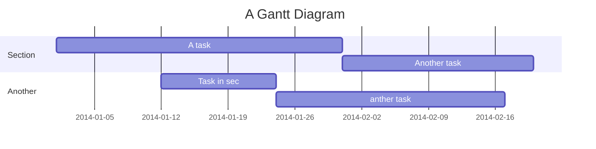

Alakoz
===

## Table of Contents

* [Introduction](#introduction)
* [Gameplay](#gameplay)
* [Content](#content)
* [References](#references)

## Introduction <a name ="introduction"></a>

This is a rogue-like platformer game developed in C# using the MonoGame framework (insert citation of creator as well as github link). The project is a passion project we started working on due to our love for game development. Our end goal with this project was to simply make something fun and enjoyable for audiences while improving our skills as developers while working as a team.

We chose to work with C# since it is often used in the game development industry. In addition, there was a plethora of interesting libraries to use with the MonoGame such as the Tiled library, which helped with map development. 

## Gameplay <a name ="gameplay"></a>

As stated in the [Introduction](#introduction), Alakoz is a rogue-like platformer. Rogue-likes are traditionally characterized as dungeon crawlers, where the players death at any given moment will end the run. With this in mind, it is important utilize the skills and mobility of the character to gain the upper hand.

MOVEMENT / CONTROLS


https://github.com/Kedi24/Alakoz/assets/117780105/1a6683cf-14d3-4feb-82e9-391ac05f5131


- General movement stuff
- Dashing 

OBSTACLES 
- Enemies
- other map obstacles

END GOAL
- goal stuff 


In addition, we chose to went with a platformer game style, since we enjoyed platforming games in general. The parkour playstyle makes the game a more thrilling experience with high stakes in each run. 

## Content <a name ="#content"></a>

### What's "done"

We have sucessfuly implemented the base classes for generic platformers such as
* Players
* Platforms
* Map
* Collisions 
* Enemy

As well as generic game design mechanics such as 
* Game states 
* Cameras


### What we plan to add
* Complex enemies
    * Follow a path finding algorithm to chase the player around the map
* Player attacks 
    * A set of classes the player can choose from, such as ranged and melee. 
    * Skills to go with those classes
* A save file system


## References <a name ="references"></a>

Hello There 
---

```gherkin=
Feature: Guess the word

  # The first example has two steps
  Scenario: Maker starts a game
    When the Maker starts a game
    Then the Maker waits for a Breaker to join

  # The second example has three steps
  Scenario: Breaker joins a game
    Given the Maker has started a game with the word "silky"
    When the Breaker joins the Maker's game
    Then the Breaker must guess a word with 5 characters
```
> I choose a lazy person to do a hard job. Because a lazy person will find an easy way to do it. [name=Bill Gates]


```gherkin=
Feature: Shopping Cart
  As a Shopper
  I want to put items in my shopping cart
  Because I want to manage items before I check out

  Scenario: User adds item to cart
    Given I'm a logged-in User
    When I go to the Item page
    And I click "Add item to cart"
    Then the quantity of items in my cart should go up
    And my subtotal should increment
    And the warehouse inventory should decrement
```

> Read more about Gherkin here: https://docs.cucumber.io/gherkin/reference/

User flows
---
```sequence
Alice->Bob: Hello Bob, how are you?
Note right of Bob: Bob thinks
Bob-->Alice: I am good thanks!
Note left of Alice: Alice responds
Alice->Bob: Where have you been?
```

> Read more about sequence-diagrams here: http://bramp.github.io/js-sequence-diagrams/

Project Timeline
---


> Read more about mermaid here: http://mermaid-js.github.io/mermaid/

## Appendix and FAQ

:::info
**Find this document incomplete?** Leave a comment!
:::

###### tags: `Templates` `Documentation`
